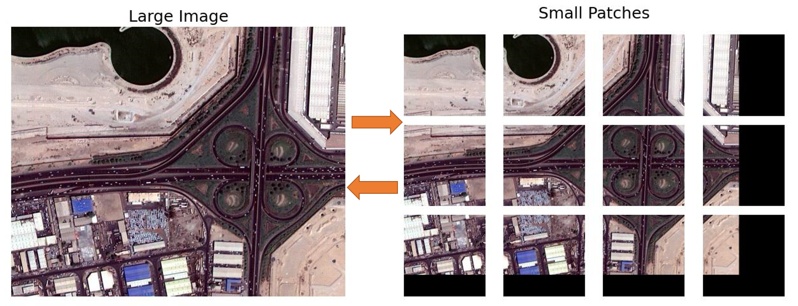

# Patcher

Pacther is a python3-based library, aiming to split a large N-dimensional array (e.g. a 2D grey or 3D color image) into small patches for processing, and then merge the small patches into a large array. 
Please see an image operation demo below.
<p align="center">
  
</p>

# Features
## Optional padding
Padding is supported in making patches. 
## Overlap manipulation
Operation functions (currently `mean` is used, `max` and `min` will be added) can be applied to the overlaps between neighbouring patches, which can be useful for semantic segmentation. 

# Installation

You can simply include the patcher folder into your project.

In the future, I will setup it on `pypi` so that you can: Install `patcher` using `pip`:

``` {.sourceCode .bash}
$ pip install patcher
```

# Usages

```angular2html

import numpy as np
from patcher import make_patches, merge_patches

""" Test on a 1D Vector """
arr = np.arange(9)
patches = make_patches(arr, (5,), step=3, do_pad=True)
assert np.allclose(patches, np.array([[0, 1, 2, 3, 4], [3, 4, 5, 6, 7], [6, 7, 8, 0, 0]]))
mosaic = merge_patches(patches, out_shape=arr.shape, step=3)
assert np.allclose(arr, mosaic)


""" Test on a 2D Matrix """
# padding
arr = np.arange(9 * 9).reshape((9, 9))
patch_shape, step = (5, 5), (3, 2)
patches = make_patches(arr, patch_shape, step=step, do_pad=True)

# out_shape is None
mosaic = merge_patches(patches, step=step)
assert mosaic.shape != arr.shape
assert np.allclose(arr, mosaic[:9, :9])


""" Test on a 3D array """

arr = np.arange(8*9*6).reshape((8, 9, 6))
patch_shape, step = (5, 5, 5), 3
patches = make_patches(arr, patch_shape, step=step, do_pad=True)
assert patches.shape == (2, 3, 2, 5, 5, 5)
mosaic = merge_patches(patches, out_shape=arr.shape, step=3)
assert np.allclose(arr, mosaic)


""" Test on a 4D array """

arr = np.arange(8*9*6*2).reshape((8, 9, 6, 2))
patches = make_patches(arr, (5, 5, 3, 2), step=(3, 3, 2, 2), do_pad=True)
assert patches.shape == (2, 3, 3, 1, 5, 5, 3, 2)
mosaic = merge_patches(patches, out_shape=arr.shape, step=(3, 3, 2, 2))
assert np.allclose(arr, mosaic)

```